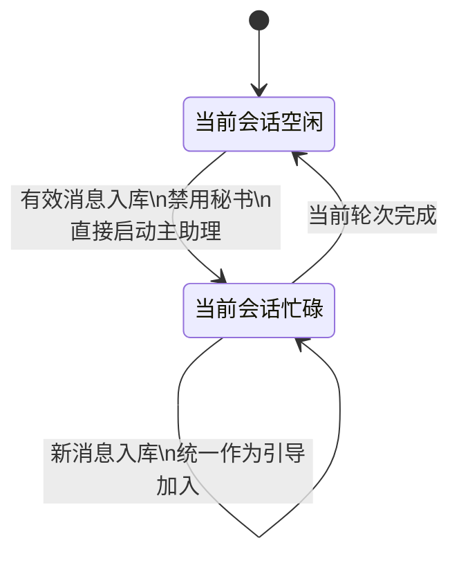
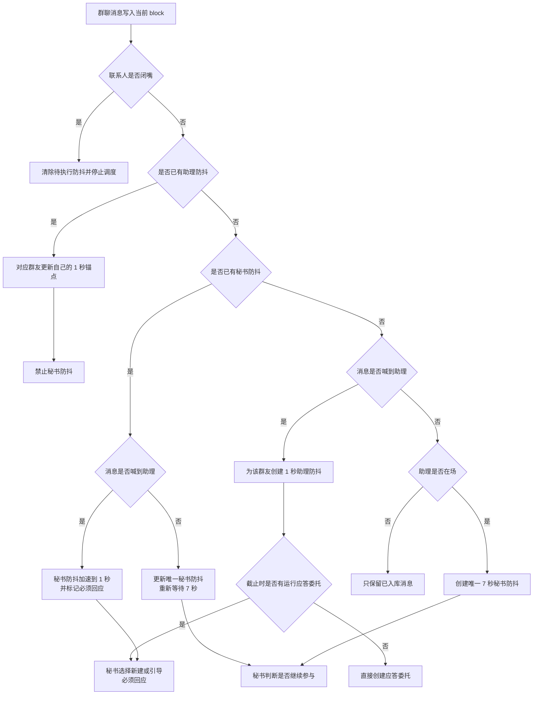
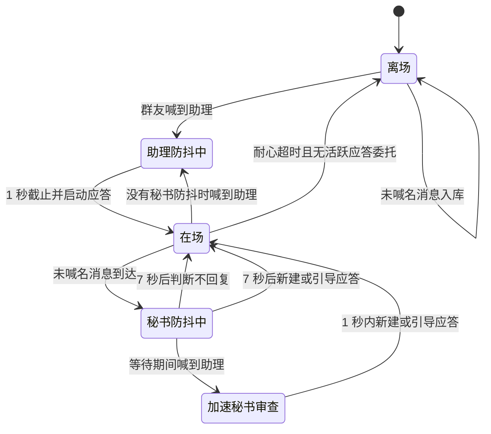

# 远程联系人状态机说明

本文使用业务语言说明当前远程联系人状态机。私聊和群聊采用不同处理模型，不能混为一套流程理解。

不同角色和委托实际获得的消息上下文，参见 [远程联系人上下文管理说明](remote_im_context_management.md)。

## 共同基础

无论私聊还是群聊，都遵守以下原则：

1. 远程消息先自然写入绑定会话。
2. 文字、图片、音频和附件都作为正式会话消息保存。
3. 联系人配置决定绑定部门、人格、会话和耐心时间。
4. 私聊与群聊的区别发生在消息入库后的应答调度阶段。

群聊联系人使用以下参与状态：

- `离场`：助理没有主动参与当前联系人的对话。
- `在场`：助理正在参与或仍处于耐心等待期。

离场/在场只属于群聊。私聊不存在这两个状态，私聊只查看绑定会话当前是空闲还是忙碌。

---

# 一、私聊状态机

## 1. 私聊的核心模型

私聊禁用秘书，所有消息强制进入绑定会话的主助理调度：

```text
私聊消息入库
→ 不经过秘书判断
→ 当前会话空闲：直接启动主助理
→ 当前会话忙碌：作为引导消息加入当前会话
→ 发送给远程联系人
```

私聊不使用群聊的：

- 每群友助理防抖；
- 会话秘书防抖；
- 远程应答委托并发路由；
- `targetDelegateId` 引导选择。

私聊始终围绕一个明确联系人和一个绑定会话串行处理。

私聊消息不存在“秘书判断不回复”的分支。只要消息成功入库，就必须进入当前绑定会话的调度链路。

私聊不存在闭嘴词、张嘴词或闭嘴状态。用户正在直接和助理沟通，不需要群聊中的参与控制。

## 2. 私聊没有离场与在场

私聊不维护联系人离场/在场状态，也不执行耐心离场计时。

- 每条有效消息正常入库；
- 不调用秘书，也不等待群聊防抖；
- 不检查激活词、离场状态或耐心时间；
- 消息直接进入绑定会话调度。

私聊不使用“是否喊到名字”决定是否响应。私聊本身已经是用户对助理的直接沟通，所有有效消息都视为明确交给当前助理处理。

## 3. 私聊空闲与忙碌

私聊只根据绑定会话的调度状态处理：

- 当前会话空闲：直接启动新一轮；
- 当前会话正在运行：消息统一作为引导消息加入；
- 引导消息在当前轮的合法检查点接管后续处理，不经过秘书判断；
- 不会为同一私聊并发创建多个远程应答委托。

私聊的重点是保证当前绑定会话持续响应用户：用户在助理忙碌期间继续发送的内容不是普通等待消息，而是直接获得引导资格。

## 4. 私聊引导消息

私聊忙碌时，所有新消息都按引导消息处理。

引导消息表示：

- 用户正在补充、纠正或追加当前私聊请求；
- 当前主助理应在合法检查点尽快看到新内容；
- 不需要秘书评估是否值得插入；
- 不创建新的并发远程应答委托；
- 不丢弃当前已经完成的工作和工具结果。

私聊引导是当前绑定会话内部的连续调度，不是群聊中的委托路由。

## 5. 私聊状态图



---

# 二、群聊状态机

## 1. 群聊的核心模型

群聊不能把所有消息都直接交给助理，否则助理会介入与自己无关的话题。群聊在消息入库后使用两种不同防抖：

```text
助理防抖：明确喊到助理时，保证及时回应
秘书防抖：没有喊到助理时，判断是否应该继续参与
```

两者不是同一种防抖，也不能使用同一条运行记录混合表示。

## 2. 当前 block 不变量

群聊在场期间，所有新消息都自然追加到当前 block。

必须始终满足：

```text
当前摘要
→ 在场期间所有消息按原始顺序连续排列
→ 防抖结束锚点
```

绝对不允许：

- 把新消息插入旧 block；
- 按群友筛选正式上下文；
- 跳过锚点范围内的中间消息；
- 把未完成防抖的锚点移出当前 block；
- 从旧 block 拼接正式应答上下文。

群友 ID 只用于确定哪个助理防抖需要更新，不用于过滤上下文。

## 3. 助理防抖

助理防抖用于“群友明确喊到助理”的情况。

数量约束：

```text
每个群友最多一个助理防抖
不同群友可以同时各有一个助理防抖
```

索引可以理解为：

```text
(联系人 ID, 群友 ID) → 0 或 1 个助理防抖
```

处理规则：

1. 群友喊到助理时，为该群友创建 1 秒助理防抖。
2. 同一群友已有助理防抖时，不创建第二个。
3. 该群友之后自然入库的文字、图片、音频或附件消息，都会更新结束锚点并重新等待 1 秒。
4. 后续消息不需要再次喊到名字。
5. 其他群友的消息不会更新这个群友的计时。
6. 其他群友的消息只要位于结束锚点之前，仍然自然包含在正式连续上下文中。

助理防抖截止后：

- 没有运行中的远程应答委托：直接创建应答委托；
- 已有运行中的远程应答委托：由秘书选择新建委托或通过 `targetDelegateId` 引导已有委托；
- 明确喊到助理时必须回应，秘书不能选择不回答。

## 4. 秘书防抖

秘书防抖用于“助理已经在场，但消息没有明确喊到助理”的情况。

数量约束：

```text
每个联系人群聊永远最多一个秘书防抖
```

处理规则：

1. 助理在场且没有助理防抖时，未喊名消息创建或更新 7 秒秘书防抖。
2. 当前群聊任意群友的新消息都会更新唯一秘书防抖的结束锚点并重新计时。
3. 连续 7 秒没有新消息后，秘书统一判断这段话题是否与助理有关。
4. 秘书可以选择：
   - 不回复；
   - 创建新的远程应答委托；
   - 通过 `targetDelegateId` 引导已有委托。

普通秘书防抖一旦建立，即使等待期间联系人转为离场，仍会完成已经安排的本次秘书判断。

秘书提示词必须固定分层：

- 系统提示词只放秘书角色、固定判断规则、路由约束和 JSON 输出协议；
- 第一个用户提示词放联系人、部门、人格、历史消息、本次防抖消息、助理工作账本、活跃委托和审查模式等动态上下文。

普通审查、喊名加速审查和忙碌路由都必须使用同一分层。具体字段和示例参见 [远程联系人上下文管理说明](remote_im_context_management.md#1-秘书提示词的固定分层)。

## 5. 助理防抖与秘书防抖的互斥

同一联系人不能同时保留待执行的助理防抖和秘书防抖。

规则：

- 存在任意助理防抖时，不创建、不更新、不执行秘书防抖；
- 已有秘书防抖期间出现喊名消息时，不再创建助理防抖；
- 现有秘书防抖改为最多 1 秒后审查；
- 这次加速审查被标记为必须回应；
- 秘书只能选择新建委托或引导已有委托。

因此：

```text
助理防抖先存在
→ 禁止秘书防抖出现

秘书防抖先存在
→ 喊名后加速秘书审查到 1 秒
→ 不并行创建助理防抖
```

## 6. 防抖只观察已入库消息

消息处理顺序固定为：

```text
消息成功写入当前 block
→ 防抖观察器收到稳定消息 ID
→ 更新已有防抖或创建新防抖
```

防抖不拥有、不消费、不移动消息。它只保存：

- 联系人 ID；
- 群友 ID（助理防抖）；
- 起点消息 ID；
- 结束锚点消息 ID；
- 版本令牌；
- 是否必须回应（加速秘书审查）。

每次更新防抖都会替换版本令牌。旧定时任务醒来后发现令牌已变化，直接退出。

## 7. 防抖截止后的消息读取

### 助理防抖

没有运行应答委托时，防抖层只按 `end_message_id` 读取目标消息，然后创建应答委托。

应答委托继续使用正式上下文链路：

```text
当前摘要
→ 当前 block 内全部连续消息
→ end_message_id
```

防抖层不提前整读当前 block。

### 秘书防抖

秘书只需要：

- 防抖起点之前最近的有限历史；
- 防抖起点到结束锚点的连续消息。

秘书判断不等于助理正式上下文。秘书决定需要回答后，应答委托仍通过正式上下文链路读取当前摘要到结束锚点的完整连续内容。

## 8. 远程应答委托

群聊正式回复由独立的远程应答委托执行。

每个委托拥有：

- 唯一委托 ID；
- 触发消息锚点；
- 负责部门与人格；
- 冻结到触发锚点的正式上下文；
- 运行状态和结果。

同一联系人可以存在多个并发应答委托。秘书通过助理工作账本查看当前工作，并使用 `targetDelegateId` 把后续内容引导到正确委托。

## 9. 助理工作账本

助理工作账本由正式委托记录和委托会话统一生成，不从聊天文本临时猜测。

账本包含：

- 委托 ID；
- 工作状态：运行中、已完成、失败；
- 触发任务摘要；
- 实际回复摘要或失败原因；
- 开始和结束时间。

账本供以下链路共用：

- 秘书回复判断；
- 忙碌时的新建或引导选择；
- 新应答委托的系统提醒；
- 群聊离场反思。

## 10. 群聊离场

成功应答后，联系人保持在场并重新计算耐心时间。

耐心时间结束且没有活跃应答委托时：

1. 联系人转为离场；
2. 启动离场反思委托；
3. 反思读取当前会话上下文和助理工作账本；
4. 只应用反思结果中的记忆操作。

离场后：

- 未喊到助理的消息只入库；
- 喊到助理的消息重新触发 1 秒助理防抖和入场处理。

## 11. 闭嘴状态

闭嘴和张嘴只属于群聊状态机，私聊不支持也不使用这套机制。

命中闭嘴词后：

- 联系人进入闭嘴期；
- 清除该联系人所有待执行助理防抖；
- 清除该联系人唯一秘书防抖；
- 中止该联系人所有仍在运行的远程应答委托；
- 不启动新的防抖；
- 定时任务真正触发时再次检查闭嘴；
- 创建或引导应答委托前再次检查闭嘴；
- 自动发送与所有真正外发路径在转发前再次检查闭嘴。

因此：

- 闭嘴期间已经存在的旧定时任务也不能产生回复；
- 闭嘴前已在途的应答，能打断就立刻打断；
- 即便生成已经完成，真正转发到远程前也必须被拦截。

命中张嘴词或闭嘴时间到期后，联系人恢复正常消息观察。

## 12. 群聊总览图



## 13. 群聊状态图



---

# 三、私聊与群聊对照

| 维度 | 私聊 | 群聊 |
|---|---|---|
| 正式执行者 | 绑定会话主助理 | 独立远程应答委托 |
| 秘书 | 完全禁用 | 负责 7 秒话题判断和忙碌路由 |
| 闭嘴/张嘴 | 不存在 | 支持群聊闭嘴期及多阶段调度拦截 |
| 调度方式 | 所有有效消息强制进入当前绑定会话 | 防抖 + 秘书路由 + 可并发委托 |
| 喊名处理 | 私聊不区分喊名，消息天然直达助理 | 每群友最多一个 1 秒助理防抖 |
| 未喊名处理 | 仍然直接调度当前会话 | 在场时唯一 7 秒秘书防抖 |
| 忙碌中新消息 | 统一作为当前会话引导消息加入 | 秘书选择新建或引导已有委托 |
| 正式上下文 | 绑定会话连续上下文 | 当前摘要到触发锚点的当前 block 连续上下文 |
| 离场/在场 | 不存在 | 存在，耐心超时且无活跃委托后离场并反思 |

## 一句话总结

私聊没有秘书、闭嘴/张嘴和离场/在场，所有有效消息强制调度当前绑定会话，忙碌时统一作为引导消息加入；群聊则在消息写入当前 block 后，由“每群友最多一个助理防抖”和“每会话最多一个秘书防抖”互斥调度，最终通过助理工作账本把消息路由到新的或已有的远程应答委托。
