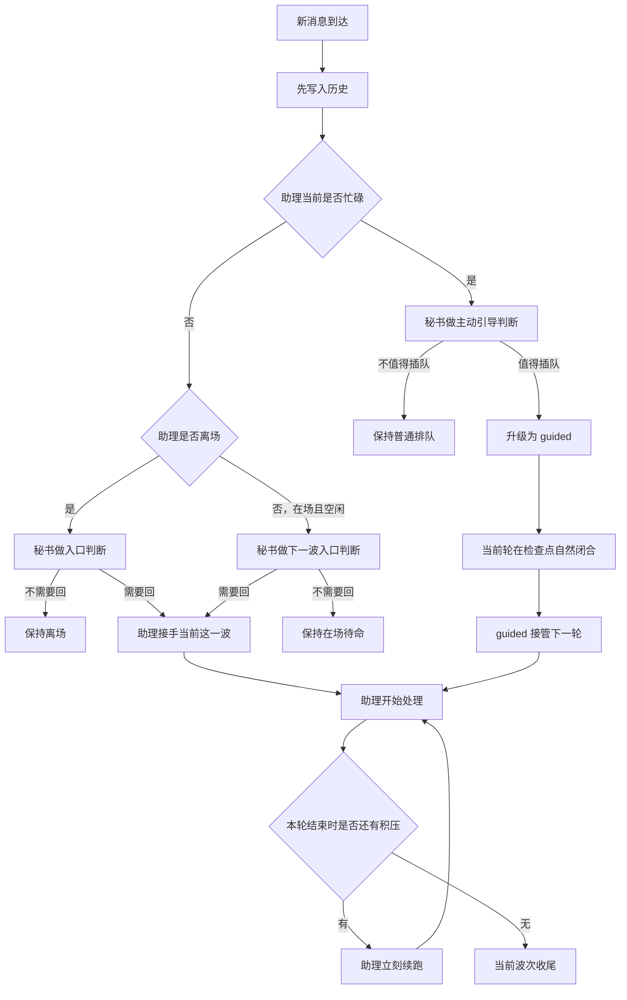
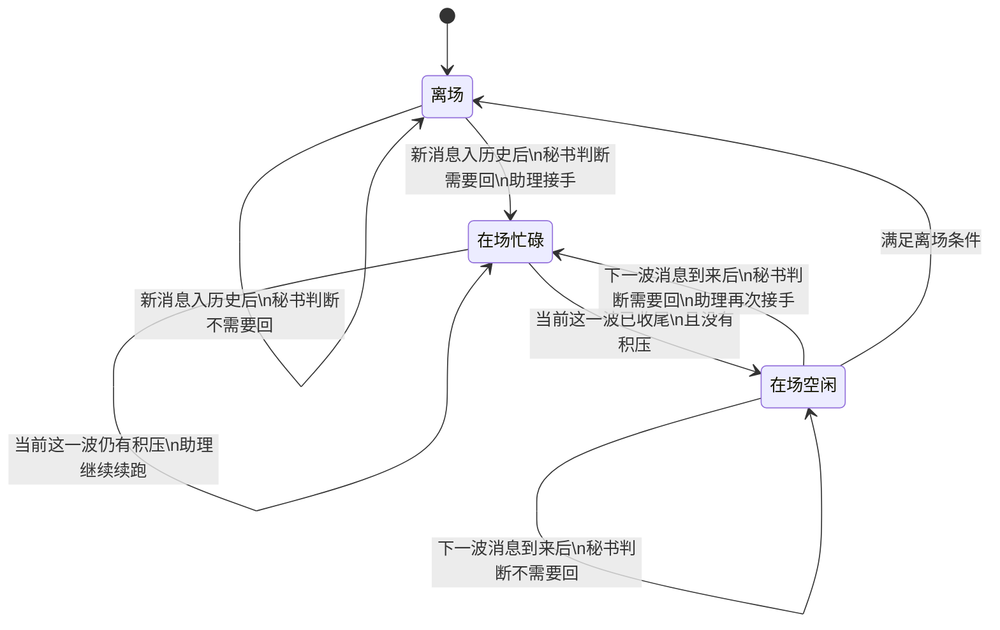
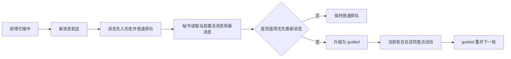

# 远程联系人状态机说明

这份文档只用业务语言说明远程联系人的状态流转，不讨论代码实现细节。

## 这套状态机在管什么

它主要解决 8 件事：

1. 联系人来消息时，是否要让助理介入
2. 助理离场时，谁来做入口判断
3. 助理在场但空闲时，下一波消息是否还要先过秘书
4. 助理已经接手的一波消息，是否应该连续做完
5. 助理忙碌中又来新消息时，是否值得优先插队
6. 插队时如何自然接管，而不是粗暴硬打断
7. 一轮回复结束后，是继续在场还是离场
8. 哪些情况算真正成功回复

## 核心角色

### 秘书

- 负责做判断
- 必须走委托
- 不允许调用工具
- 不直接回复远程联系人

秘书承担两类判断：

1. 入口判断
   - 判断这一波新消息是否需要让助理接手
2. 主动引导判断
   - 助理忙碌时，判断刚来的新消息是否值得优先插队

### 助理

- 负责正式回复
- 负责处理已经接手的这一波消息
- 负责把同一波里的积压尽量连续做完

### 引导消息（guided）

- 是一种优先接管资格
- 不等于立刻硬中断
- 会在合适检查点接管下一轮

## 核心状态

这套状态不是一个单一值，而是几项组合出来的。

### 1. 在场状态

- `离场`
  - 当前不会主动接待这位联系人
  - 新消息先过秘书入口判断

- `在场`
  - 当前仍愿意继续接待这个联系人
  - 但不代表所有后续消息都永久直通助理

### 2. 工作状态

- `空闲`
  - 当前没有正在处理这一位联系人的轮次

- `忙碌`
  - 当前正在处理这一位联系人的一轮消息

### 3. 待办标志

- `无待办`
  - 当前没有积压的新消息

- `有待办`
  - 忙碌期间又来了新消息
  - 当前轮次结束后要立刻继续处理

### 4. 边界标志

- `需要插入上下文边界`
  - 这位联系人刚从"离场"重新回到"在场"
  - 下一轮正式处理前，要先做一次上下文滑窗

### 5. 上次成功回复时间

这不是状态名，但它会影响是否离场。

- 只有真正成功回复了对方，才会刷新这个时间
- 明确"不回复"不会刷新它

## 同一波与下一波

这是整套机制最关键的边界。

### 同一波

满足以下特征时，视为同一波：

- 助理已经接手
- 当前轮结束时仍然有积压

结果：

- 助理由自己继续续跑
- 不重新经过秘书

### 下一波

满足以下特征时，视为下一波：

- 助理上一轮已经做完
- 当前没有积压
- 之后又来了新消息

结果：

- 新消息重新先过秘书

所以真正的边界不是"人还在不在场"，而是：

- 当前这一波有没有正式收尾

## 配置项

### 激活关键字

- 仅在秘书判断时作为参考
- 当前规则是最简单的"消息里包含这个词就算命中"

### 耐心时间

- 默认 `60` 秒
- 含义是：
  - 如果当前人在"在场 + 空闲"
  - 新消息又没有命中关键字
  - 并且距离上次成功回复已经超过这段时间
  - 那就直接离场

## 总览图

## 主状态图

## 忙碌中的主动引导图

## 触发状态变化的 4 个时机

### 1. 新消息刚进来时

这时会决定：

- 当前要不要理这条消息
- 如果人在离场，秘书是否判定需要回
- 如果人在在场但已经太久没成功回复，是否直接离场

### 2. 消息已经写进历史时

这时会决定：

- 是否正式开始新一轮处理
- 如果刚从离场回来，是否先做一次上下文边界
- 如果当前已经忙碌，是否把新消息记成待办

### 3. 当前这一轮结束时

这时会决定：

- 从忙碌切回空闲
- 要不要更新"上次成功回复时间"
- 要不要离场
- 如果有待办，要不要立刻再开一轮

### 4. 异步外发真正完成时

如果这一轮选择的是"异步发给远程联系人"，要等真正发送成功后，才算一次成功回复。

## 三条入口规则

### 1. 离场入口

当助理处于离场时：

1. 新消息先入历史
2. 由秘书做一次入口判断
3. 如果需要回，助理接手并进入在场
4. 如果不需要回，助理保持离场

这里的关键点是：

- 消息始终先进入历史
- 秘书管的是"是否接手"，不是"是否收信"

### 2. 在场且空闲入口

当助理仍然在场，但上一波已经收尾、当前没有积压时：

1. 新消息先入历史
2. 不直接交给助理
3. 重新先过秘书

判断结果：

- 需要回：助理再次接手
- 不需要回：助理保持在场待命

这里要强调的是：

在场不等于永久绕开秘书。

### 3. 忙碌中入口

当助理正在忙碌中：

1. 新消息先入历史
2. 默认先进入普通排队
3. 由秘书额外做一次主动引导判断

判断结果：

- 不值得插队：继续普通排队
- 值得插队：升级为 `guided`

这里要强调的是：

不是"新消息一来就硬打断"，而是"先由秘书判断值不值得引导接管"。

## 详细流转规则

### 1. 离场 -> 在场

条件：

- 秘书判定新消息"需要回"

结果：

- 联系人重新回到在场
- 会打上"需要插入上下文边界"的标记
- 这条消息允许进入后续处理

说明：

- 这一步只是"重新接待"
- 还不是"正式忙起来"

### 2. 离场保持不变

条件：

- 秘书判定新消息"不需要回"

结果：

- 只记录消息
- 不启动处理

### 3. 在场 + 空闲 -> 离场（提前离场）

条件：

- 当前是"在场 + 空闲"
- 新消息没有命中关键字
- 并且距离上次成功回复已经超过耐心时间

结果：

- 当场直接离场
- 这条消息不再触发处理

说明：

- 这是"看到新消息当下就直接离场"
- 不再等模型先跑一轮再决定不回

### 4. 在场 + 空闲 -> 在场 + 忙碌

条件：

- 联系人已经在场
- 当前也不忙
- 这条消息已经正式写入历史
- 秘书判定需要回（如果是新一波消息）

结果：

- 正式进入忙碌状态
- 开始处理这一轮
- 如果之前刚从离场回来，会先插入一条上下文边界，再开始这一轮

### 5. 在场 + 忙碌时又来了新消息

条件：

- 当前正在忙

结果：

- 不会并发再开一轮
- 不会打断当前轮次
- 只会把"有新消息待办"这个标志记下来

说明：

- 这个待办的真正意义就是：忙完以后继续办

### 6. 忙碌 -> 空闲

每一轮结束时，都会先从忙碌切回空闲。

然后再根据这一轮的结果，决定：

- 是否更新上次成功回复时间
- 是否继续在场
- 是否立即处理待办

### 7. 本轮结果是 send

含义：

- 这轮明确给对方发了内容

结果：

- 联系人继续保持在场
- 这次会算作一次成功回复
- 会刷新"上次成功回复时间"

### 8. 本轮结果是 send_async

含义：

- 这一轮决定异步外发

结果：

- 当前轮次结束时，联系人先保持在场
- 但这时还不算成功回复
- 只有远程平台真的发送成功后，才会刷新"上次成功回复时间"

说明：

- 异步发送失败，不算成功回复

### 9. 本轮结果是 no_reply

含义：

- 这一轮明确决定不回复

结果：

- 工具会先固定等待 `7` 秒
- 然后本轮结束
- 这次**不算**成功回复
- 所以不会刷新"上次成功回复时间"

后续状态：

- 如果没有待办：
  - 耐心已经耗尽：离场
  - 耐心还没耗尽：继续在场
- 如果有待办：
  - 继续在场
  - 并准备接着处理下一轮

说明：

- `no_reply` 的真实语义不是"立刻跳过"
- 而是"我决定不回，并发呆 7 秒"

### 10. 待办自动续跑

条件：

- 当前这一轮结束前，忙碌期间又收到了新消息
- 也就是待办标志为真

结果：

- 当前轮次结束后，会先把待办标志清掉
- 联系人保持在场
- 然后立刻再开一轮处理下一批消息

说明：

- 这就是"忙完继续办"
- 现在待办不再只是一个摆设标志

## 引导消息的语义

引导消息代表一条消息拿到了优先接管资格。

它的作用是：

1. 让一条后来的新消息获得优先级
2. 让当前轮在合适检查点闭合
3. 由这条 `guided` 消息重开下一轮

它不代表：

1. 立刻中止正在执行的工具
2. 把消息硬塞进当前尚未闭合的模型请求
3. 丢弃当前已经完成的工作

## 特殊语义说明

### 1. 所有消息先入历史

无论是：

- 助理离场
- 助理在场
- 秘书判断不回
- 普通排队
- 升级为 `guided`

消息都先进入历史，再决定后续处理。

### 2. 秘书不做正式回复

秘书永远只做判断，不做执行。

### 3. 秘书不插手同一波续跑

只要还是助理已经接手的当前这一波：

- 就由助理连续做完
- 不再让秘书反复审一遍

### 4. 主动引导也是秘书职责

忙碌中的优先级判断，不是独立角色，而是秘书在另一处入口承担的判断职责。

### 5. 引导接管是自然闭合后的重开

`guided` 的意义是让下一轮优先接管，不是强制把当前轮粗暴切碎。

### 6. 待办不是独立状态

不会单独显示成：

- `等待中`
- `挂起中`

它只是一个附加标志，含义是：

- 当前人在忙
- 忙的时候又来了新消息
- 这一轮结束后要立刻接着办

### 7. 上下文边界只在"重新回到在场"时插一次

作用：

- 避免离场很久后，上下文无限堆积
- 回来时先收口历史，再继续聊

### 8. 上次成功回复时间只认真正回复

会刷新：

- `send`
- `send_async` 真正发送成功

不会刷新：

- `no_reply`
- `send_async` 失败
- 单纯收到消息但没回

## 新消息处理流程

下面这段不是"状态定义"，而是"当一条新消息到来时，系统实际会怎么走"。

### 场景一：联系人发来一条新消息

1. 消息先写入历史
2. 系统判断助理当前是否忙碌
3. 如果不忙碌：
   - 如果助理离场：秘书做入口判断
     - 需要回：助理接手
     - 不需要回：保持离场
   - 如果助理在场且空闲：秘书做下一波入口判断
     - 需要回：助理再次接手
     - 不需要回：保持在场待命
4. 如果忙碌：
   - 消息进入普通排队
   - 秘书额外做一次主动引导判断
   - 值得插队：升级为 `guided`
   - 不值得插队：保持普通排队

### 场景二：消息被正式写入会话历史

1. 消息先进入正式历史
2. 如果这位联系人当前仍然离场：
   - 到这里就结束
   - 只记录，不处理
3. 如果联系人当前在场并且空闲：
   - 系统把他切成忙碌
   - 开始本轮处理
4. 如果联系人当前在场但已经忙碌：
   - 不会并发再开一轮
   - 只维持"有待办"

### 场景三：开始本轮处理前

如果这位联系人刚刚是从离场重新回来的：

1. 系统会先做一次上下文边界整理
2. 把旧历史收口
3. 再开始这一轮正式处理

这样可以避免离场很久后，历史上下文越堆越重。

### 场景四：本轮处理中

这一轮里，模型最终必须做一个明确决策：

- 回复
- 异步回复
- 不回复

如果这时又来了新消息：

- 不会插队
- 不会并发
- 只会记成待办

### 场景五：本轮结束

当前轮次结束时，一定会先从"忙碌"回到"空闲"。

然后再根据本轮决策分支处理：

#### 情况 A：正常回复

- 继续保持在场
- 刷新"上次成功回复时间"

#### 情况 B：异步回复

- 当前轮次先结束
- 先保持在场
- 要等远程平台真正发送成功，才刷新"上次成功回复时间"

#### 情况 C：决定不回复

- 先发呆 7 秒
- 再结束本轮
- 不刷新"上次成功回复时间"
- 然后再看：
  - 是否有待办
  - 耐心是否耗尽

### 场景六：本轮结束后发现有待办

如果这一轮忙碌期间积压了新消息：

1. 当前轮次结束
2. 系统清掉待办标志
3. 继续保持在场
4. 立刻再开下一轮

这就是"忙完继续办"。

### 场景七：什么时候会自动离场

有两种主要情况：

#### 1. 新消息到来当下直接离场

条件：

- 当前在场
- 当前空闲
- 激活方式是关键字
- 新消息没命中关键字
- 距离上次成功回复已经超过耐心时间

结果：

- 当场离场
- 这条消息只记录，不处理

#### 2. 本轮决定不回复后离场

条件：

- 当前没有待办
- 决定不回复
- 并且耐心已经耗尽

结果：

- 本轮结束后离场

## 当前默认值

- 耐心时间默认：`60` 秒
- `no_reply` 发呆时间：`7` 秒

## 一句话总结

消息总是先入历史；离场时由秘书决定助理是否出场，在场且空闲时下一波仍先过秘书，助理一旦接手同一波就自己连续做完；忙碌中若来了更值得先看的新消息，也仍由秘书判断是否升级为 `guided`，再让它在合适检查点自然接管下一轮。
